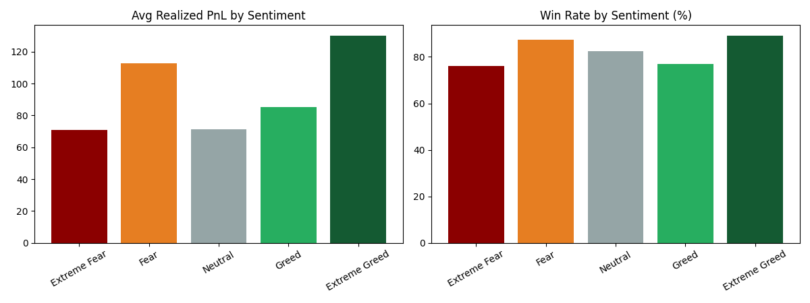
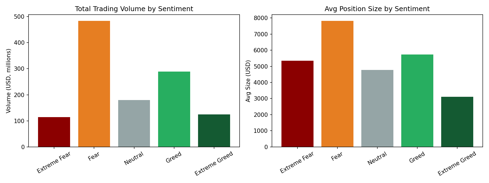
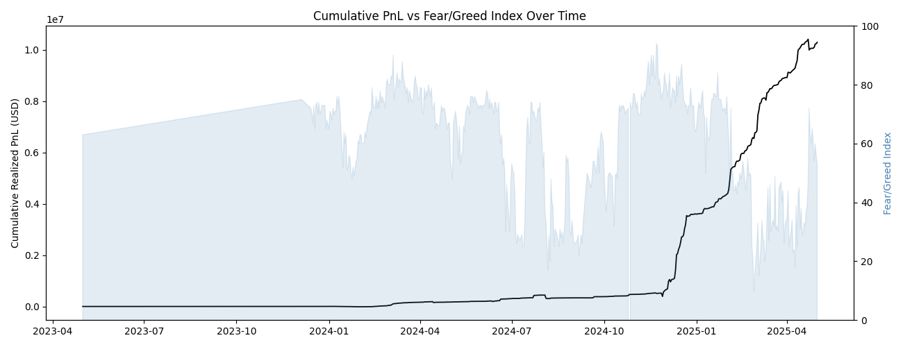
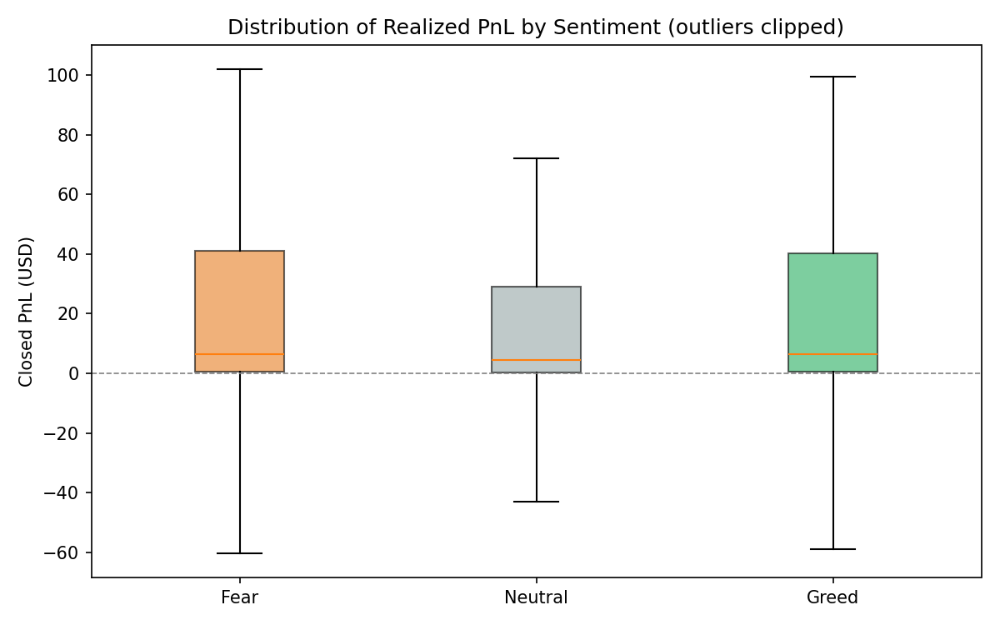
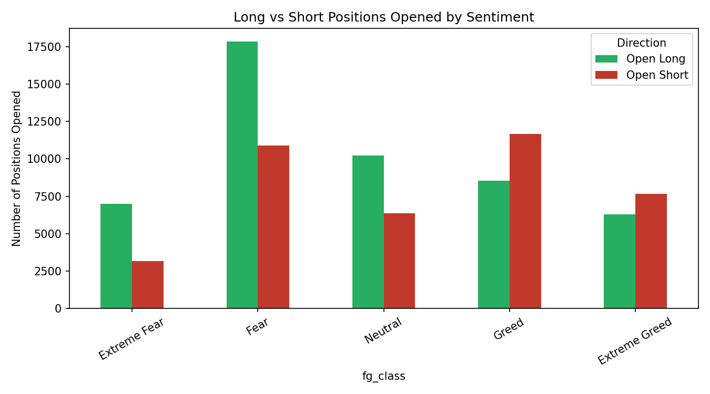

# Trader Performance vs. Bitcoin Market Sentiment

Analysis of Hyperliquid trader behavior against the Bitcoin Fear & Greed Index (May 2023 – May 2025).

## Overview

This project merges **211,224 trade executions** from 32 Hyperliquid accounts with the daily **Bitcoin Fear & Greed Index** to test whether market sentiment relates to trader performance, and to surface actionable patterns for trading strategy.

## Datasets

| Dataset | Description |
|---|---|
| `historical_data.csv` | Hyperliquid trade executions — account, coin, price, size, side, direction, closed PnL, fees |
| `fear_greed_index.csv` | Daily Bitcoin sentiment score (0–100) and 5-class label (Extreme Fear → Extreme Greed) |

*(Raw data files are not included in this repo — see `sentiment_trading_analysis.py` for expected paths.)*

## Key Findings

- **No simple "fear = bad, greed = good" relationship.** Extreme Greed was the best-performing regime (avg PnL **$130.21**, **89%** win rate); Extreme Fear was the worst (avg PnL **$71.03**, **76%** win rate) — but *moderate* Fear beat *moderate* Greed on both metrics.
- **Win rate differs significantly by sentiment; average PnL size does not.** Chi-square test on Fear vs. Greed win/loss counts: χ² = 60.0, **p < 0.0001**. Welch's t-test on average PnL: t = -0.40, **p = 0.69** (not significant).
- **Sentiment score barely correlates with PnL directly** — r ≈ 0.01 at the trade level, -0.08 at the daily level. Sentiment alone is a weak linear predictor of profit.
- **Trading behavior shifts with sentiment even where profitability doesn't**: average position size is largest during Fear ($7,182 vs. $4,574 in Greed); long positions dominate in Fear while shorts pick up in Greed.
- **Results are highly trader-specific.** Some of the 32 accounts perform best in Fear, others in Greed — there's no universal rule.

| Sentiment | Realized Trades | Avg PnL | Win Rate |
|---|---:|---:|---:|
| Extreme Fear | 10,406 | $71.03 | 76% |
| Fear | 29,808 | $112.63 | 87% |
| Neutral | 18,159 | $71.20 | 82% |
| Greed | 25,176 | $85.40 | 77% |
| Extreme Greed | 20,853 | $130.21 | 89% |

## Visualizations

**Avg PnL & win rate by sentiment**

**Trading volume & position size by sentiment**

**Cumulative PnL vs. Fear/Greed Index over time**

**PnL distribution by sentiment**

**Long vs. short positions opened by sentiment**

## Methodology

1. Parsed trade timestamps to calendar dates and joined to the sentiment index on date (99.997% match rate).
2. Collapsed the 5-class sentiment label into a 3-bucket view (Fear / Neutral / Greed) for aggregate comparisons.
3. Restricted win-rate analysis to "realized" trades (non-zero Closed PnL) since many rows are position-opening legs.
4. Ran Welch's t-test and Mann-Whitney U for PnL differences, chi-square for win-rate differences, and Pearson correlation for sentiment score vs. PnL (trade-level and daily-aggregate level).
5. Broke down results by account and by coin to check for heterogeneity.

## Strategy Implications

- Treat the Fear/Greed index as a 5-class signal, not a binary one — the extremes behave differently from their moderate counterparts.
- Position sizing already scales up during Fear for this trader cohort; Extreme Fear (the weakest regime) is arguably where size should be trimmed, not increased.
- Any sentiment-based overlay should be back-tested per trader/instrument rather than applied as a blanket rule, given the heterogeneity in Section 7 of the full report.
- Sentiment is best combined with other signals (volatility, momentum) rather than used standalone, given its weak linear correlation with PnL.

## Files

- `sentiment_trading_analysis.py` — full, reproducible analysis (pandas, scipy, matplotlib)
- `charts/` — all generated visualizations
- `requirements.txt` — Python dependencies

## Limitations

- Sample limited to 32 accounts; may not generalize to the broader trader population.
- Closed PnL captures realized gains/losses only, not unrealized exposure.
- No explicit leverage field in the source data, so leverage-specific risk analysis wasn't possible.
- Sentiment is daily-resolution and applied uniformly to all trades on a given date.
